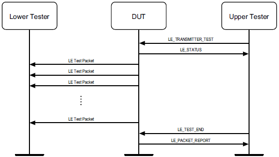
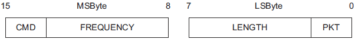
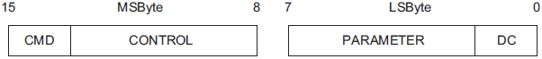
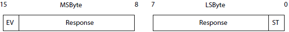
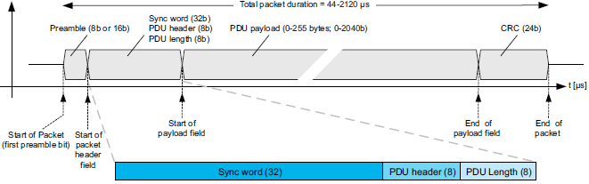
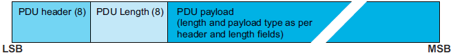
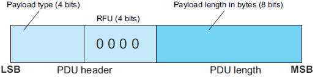

# 深入BLE协议栈 —— 直接测试模式

BLE协议充分考虑了设备的测试问题，在协议栈层面提供了直接测试模式，用于执行BLE设备的RF物理层一致性测试。

直接测试模式（Direct Test Mode）常简称为DTM。

DTM测试的核心工作是令设备在指定的频率上发送一段数据序列，在另一端使用测试设备，接收数据序列并给出测试报告，或者反过来测试设备发送一段数据序列，BLE设备接收并给出测试报告。

测试报告中会给出通信频率的偏移量，频率的功率，通信丢包率PER（Packet Error Rate）等信息，并根据这些信息判断BLE设备的物理层是否设计合格。

## 1. 工作模式介绍

DTM测试的基本模式如下：

左侧DUT（Device Under Test）表示待测设备，右侧Upper Tester表示上位机测试设备，通常使用PC代替，右侧Lower Tester表示下位机测试设备，通常是一台专业的蓝牙RF测试设备。

上位机与DUT之间使用串口线连接，上位机发送测试命令，DUT执行指定的操作，并返回执行结果。串口至少应支持以下几种波特率：1200、2400、9600、14400、19200、38400、57600、115200。

下位机接收DUT发送的信号，或向DUT发送信号，并给出报告。

值得注意的是，图中DUT与下位机之间的连线既有实线又有虚线。实线是指二者之间用一根同轴电缆传输RF信号，虚线是指RF信号在空间中进行无线传输。使用同轴电缆，需要考虑接口处的阻抗匹配和功率损耗，使用无线传输则要考虑外部无线干扰，需要在一个屏蔽箱或屏蔽室内进行测试才能保证准确。

假如RF测试设备具有串口收发能力，那么该设备能够独立完成全部测试任务。

## 2. 测试内容

PC向DUT发送测试命令，具体如下：

| 测试命令                | 含义         |
| ------------------- | ---------- |
| LE_TEST_SETUP       | 设置测试       |
| LE_TRANSMITTER_TEST | BLE设备发射机测试 |
| LE_RECEIVER_TEST    | BLE设备接收机测试 |
| LE_TEST_END         | 停止测试       |

DUT收到命令会向PC返回事件消息，具体如下：

| 事件消息             | 含义                |
| ---------------- | ----------------- |
| LE_STATUS        | 收到命令后，DUT返回命令执行状态 |
| LE_PACKET_REPORT | 停止测试后，DUT返回测试报告   |

实际工作时，PC与DUT之间的工作流程如下所示：

发送测试：

接收测试：

## 3. 命令与事件

命令与事件都是2字节数据，在串口中传输时按照MSB优先传输。

### 3.1 命令

收发机测试命令的数据帧格式如下：

设置测试和停止测试的命令数据帧格式如下：

两种数据格式的首位2bite都是CMD：

- CMD = 00b，表示该命令为Test Setup。
- CMD = 01b，表示该命令为Receiver Test。
- CMD = 10b，表示该命令为Transmitter Test。
- CMD = 11b，表示该命令为Test End。

#### Test Setup命令

Control = 0x00, Param = 0x00，表示重置测试参数。

Control = 0x02, Param = 0x01-0x04，设置不同的物理层。

#### Test End命令

Control = 0x00, Param = 0x00，表示停止测试。

#### Transmit Test命令

Frequency = 0x00 ~ 0x27，分别代表0-39信道频率。

PKT = 00b ~ 11b，表示不同的0/1测试序列。

Length的低6位表示Payload的数据长度。

### 3.2 事件

事件只有两种，一种是LE_Test_Status_Event事件，另一种是LE_Packet_Report_Event事件。

LE_Test_Status_Event事件的数据帧格式如下：

其中EV = 0。Response包含了状态信息。ST（Status）表示结果是成功还是失败。

LE_Packet_Report_Event事件的数据帧格式如下：

其中EV = 1。Packet Count表示收到的数据帧总数，其有效范围是0 - 32767。

## 4. 测试数据

当进行收发机测试时，RF数据格式不是标准的BLE数据格式，它无法被BLE主机扫描，仅能被BLE射频测试设备识别。

### 4.1 数据格式

对于非编码型物理层设备，测试数据格式如下：

对于编码型物理层设备，数据格式略有不同，增加了编码相关的字段。

测试时，数据不执行白化操作，不执行CRC计算并将其设置为常数值，前导码和Sync Word也均设置为固定常数值。

### 4.2 数据PDU

数据PDU的格式如下：

其中Payload的格式如下：

第一部分Payload Type代表了测试数据的类型，可用的测试数据包括：

- PRBS9
- PRBS15
- 有规则的0/1序列
- 纯0或纯1

PRBS9表示9-bit的为随机数，由协议栈内部生成。

（完）

