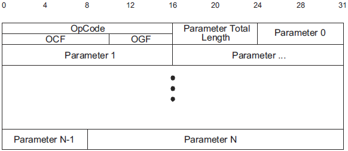
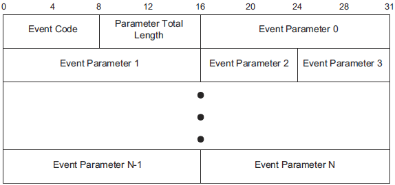
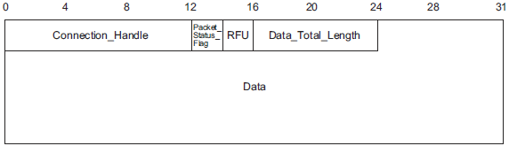

# 深入BLE协议栈 —— 主机控制器接口

BLE协议栈规定物理层、链路层和DTM层属于控制器，其他协议层属于主机，主机与控制器之间的通信是通过主机控制器接口传输层完成的。

主机控制器接口常简称为HCI（Host Controller Interface）。

HCI定义了一套“命令-事件”机制，主机向控制器发送HCI命令，控制器向主机返回HCI事件。BLE应用层的操作指令都会转换成HCI命令，而应用层接收到的数据包也都来自于HCI事件。

## 1. HCI通信

HCI接口物理形式可以是串口、SPI、USB和三线串口。

对于串口HCI，其通信模型如下：

上图左侧蓝牙主机向右侧蓝牙控制器发送命令，控制器返回命令执行状态。

当收到对端设备发送的消息，控制器会以事件形式发送给主机。

### 1.1 HCI命令

HCI命令包的基本结构包括：操作码OpCode、参数总长度和参数个数，如下图所示：

为了避免控制器的缓冲区溢出，发送命令包时需要应用流程控制。主机向控制器发送一个命令，控制器返回命令执行状态事件，事件中包含参数Num HCI Command Packets，该参数指主机可以发送的最大命令包的数量。

控制器按接收顺序执行主机命令，不过后面的命令可能提前执行完毕。

如果命令执行出错，将在控制器的状态事件中包含错误码。

BLE支持共77个命令，分为三类：

- 读写控制器参数
- 执行指定操作
- 管理链接状态

所有BLE的命令，其命令包中OGF字段都等于0x08。

读写控制器参数的命令举例：

- LE Read Advertising Channel Tx Power Command：该命令读取广播通道的发射功率，OCF=0x0007，无传入参数，控制器返回包括了实际发射功率的状态信息。
- LE Set Advertising Data Command：该命令设置广播数据内容，OCF=0x0008，传入参数为广播数据内容，控制器返回执行命令的状态信息。

执行指定操作的命令举例：

- LE Transmitter Test Command：该命令执行发射机功能测试，OCF=0x001E，传入参数为信道号和发射的内容，控制器返回执行命令的状态信息。

- LE Set Advertising Enable Command：该命令使能广播操作，传入参数为Advertising Enable，控制器返回执行命令的状态信息。

管理链接状态的命令举例：

- LE Create Connection Command：该命令建立一个连接，传入参数为连接参数信息，控制器无返回值。

### 1.2 HCI事件包

HCI事件包的基本结构包括：时间代码， 参数总长度和具体参数，如下图所示：

HCI事件包不强制要求流程控制，因为通常主机总是具有充足资源来处理控制器返回的事件。

当连接断开时，主机默认所有命令都已经执行完毕，将不再接收任何事件。

控制器收到不同的主机命令，可能返回以下类型事件：

- 执行完毕事件
- 状态信息事件

对于不涉及连接的命令，可以立即得到执行结果，执行完毕事件报告该命令执行成功或失败。

对于涉及连接的命令，无法立即得到执行结果，命令执行完毕后，先返回执行完毕事件，等命令最终结果产生，再返回新的执行完毕事件。比如LE Create Connection Command命令，执行命令时先返回执行完毕，表面链路层开始执行或加入执行队列，待两端设备建立连接，将返回连接完成事件。

部分读命令，比如LE Read Advertising Channel Tx Power Command，执行完毕后将读取结果存放在状态信息事件中返回。

HCI事件包括BLE专有事件和通用事件，通用事件还适用于经典蓝牙。BLE专有事件称为“元事件（LE Meta Event）”，共有20个，它们的事件代码均为0x3E，包括：

- LE Connection Complete Event
- LE Advertising Report Event
- LE Connection Update Complete Event
- ……

### 1.3 HCI数据包

当两个设备建立连接后相互收发数据，主机将HCI数据包传给控制器，再通过无线发送到对端设备。

由于是面向同步连接的数据包，这类数据包也被称为SCO(Synchronous Connection Oriented)数据包。

HCI包的基本结构包括：Connection_Handle、Packet_Status_Flag、数据总长度和数据内容，如下图所示：

其中，Connection_Handle表示当前连接所对应的句柄，Packet_Status_Flag仅在控制器发给主机的数据包中有效，表示数据接收的异常状态。

### 1.4 HCI包类型

上面提到了三种HCI包：命令包、事件包和数据包。命令包是从主机发向控制器，事件包是从控制器发向主机，数据包则可双向发送。

HCI层本身不去区分这三种包类型，因此在HCI接口信息中需要额外加入包类型指示位，串口型HCI层的包类型指示位如下：

| HCI包类型 | 指示位  |
| ------ | ---- |
| 命令包    | 0x01 |
| 事件包    | 0x04 |
| 数据包    | 0x03 |

指示位缺少0x02，该位用于经典蓝牙概念。

包类型指示位在HCI包发送前发给给主机或控制器。

（完）