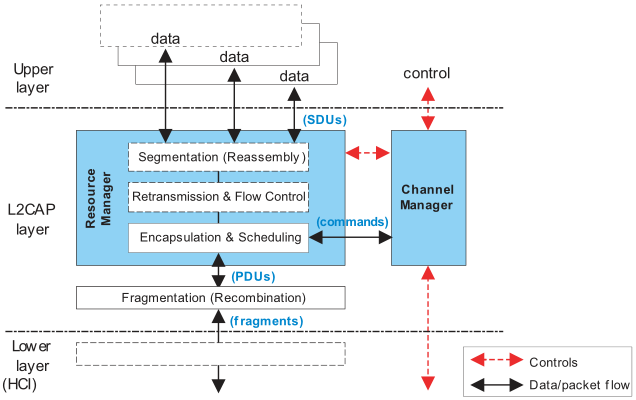
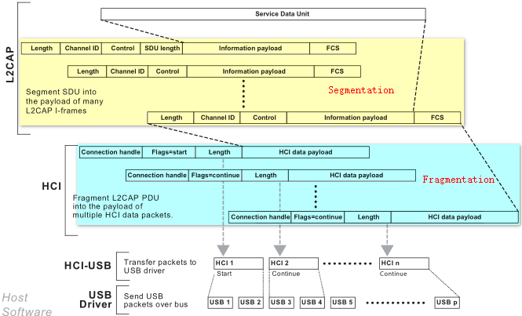
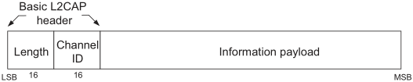
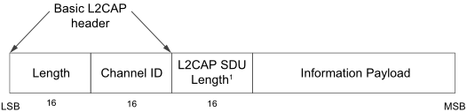
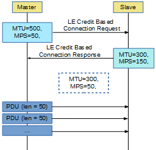
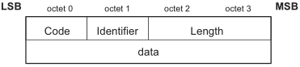

# 深入BLE协议栈 —— 逻辑链路控制与适配层

逻辑链路控制与适配层通常简称为L2CAP（Logical Link Control and Adaptation Layer Protocol），它向上连接应用层，向下连接控制器层，发挥主机与控制器之间的适配器的作用，使上层应用操作无需关心控制器的数据处理细节。

经典蓝牙的L2CAP层协议比较复杂，它实现了协议复用、数据分段与重组、封装调度等操作，使得主机能够支持LE和BR/EDR不同的控制器，实现音频数据流传输等高级功能。

BLE的L2CAP层是经典蓝牙L2CAP层的简化版本，它在基础模式下，不执行分段和重组，不涉及流程控制和重传机制，仅使用固定信道进行通信，在LE令牌流控模式下，实现了流程控制，执行数据分段和重组，使用动态信道进行通信。

## 1. 功能

完整的L2CAP层的功能模块分解图如下所示：

L2CAP层包括两个功能模块：资源管理器和信道管理器。

L2CAP层向下连接控制器的HCI接口，向上对应用层暴露数据收发接口。

应用层发送给L2CAP层的数据称为SDU（Service Data Unit），SDU可能是属性协议层的读写数据，也可能是链接配置命令，也可能是配对绑定数据。

SDU在资源管理器中添加L2CAP协议头信息，封装成L2CAP数据包，简称PDU（Protocol Data Unit）。PDU的Payload字段就包含了SDU或SDU的一部分。

通常HCI接口无法发送较长数据包，需要对PDU进行分解（Fragmentation），变成数据碎片（Fragment）再依次发送到控制器。PDU总是包含完整的L2CAP协议头，而数据碎片则不是完整的L2CAP数据包。

如果资源管理器中采用了流程控制或重传机制，则可以实现传输很长的数据包，理论上长度最大可以达到65535个字节。一个很长的SDU，需要先进行分段（Segmentation），分成一个个短小的数据片段，然后再分别添加协议头封装成对应的PDU。

L2CAP协议给出两个数据包长度参数以指导分段和分解操作：MTU和MPS。

MTU（Maximum Transmission Unit）表示L2CAP层的最大可传输单元，该参数限制了应用层与L2CAP层之间传输数据的最大长度，即最大的SDU长度。经典蓝牙默认MTU值为672字节，BLE默认MTU值为23字节，意味着BLE的应用层发送给L2CAP层的数据包长度最大为23字节，超过该长度的数据包将会触发错误处理机制。

MPS（Maximum PDU payload Size）表示L2CAP层PDU的Payload最大长度，该参数限制了单个PDU的长度。分段操作时，每个段的最大长度等于MPS。

显然，L2CAP层中MPS值小于等于MTU值。两个设备建立连接时，会交换MTU和MPS信息，取最小值作为有效值进行工作。

下图为经典蓝牙的分段和分解过程示意图：

SDU进入L2CAP层，先进行分段操作，对各PDU再执行分解操作变成数据片段传入HCI层。注意到，分解操作实际上是在HCI层执行。

信道管理器负责将不同协议的数据分派到合适的信道中。

## 2. 信道ID

信道ID（Channel ID）简称CID，用一个2字节数表示L2CAP层的一个逻辑信道。

逻辑信道与真实信道不同，真实信道是指无线通信的频道，不同信道的频率不同，逻辑信道是指某个协议所占用的通道，不同协议使用不同的信道，它与射频频率无关，所以称为逻辑信道。不同的逻辑信道在控制器中可能使用相同的物理信道。

在不产生混淆的情况下，这里将L2CAP层的逻辑信道简称为信道。

L2CAP层拥有两种信道，固定信道和动态信道。两端设备一旦建立连接，固定信道即可使用而无需额外配置，建立动态信道则需要首先执行配置过程。BLE仅在收发数据时候与对端设备连接，适合使用固定信道。

0x0001-0x003F部分是固定信道，0x0040之后信道是动态信道。

BLE所使用的信道如下：

| CID           | 描述                      | 信道类型 |
| ------------- | ----------------------- | ---- |
| 0x0004        | 属性协议信道                  | 固定信道 |
| 0x0005        | LE信令信道                  | 固定信道 |
| 0x0006        | 安全管理协议信道                | 固定信道 |
| 0x0020-0x003E | 官方编号（Assigned Number）信道 | 固定信道 |
| 0x0040-0x007F | 基于令牌连接机制的通信信道           | 动态信道 |

0x0004属性协议信道用于收发属性协议层的数据，也就是BLE应用层通信所传输的数据。

0x0005信令（Signaling Command）信道用于处理应用层发送的命令。

0x0006安全管理协议信道用于处理加密、配对和绑定等相关数据。

0x0020-0x003E官方编码信道没有明确指明如何使用。官方编码是指包括UUID、BD_ADDR、Comany_ID等一些列已经授权过的数字串。

0x0040-0x007F令牌连接的通信信道是动态信道，它专用于LE令牌流控工作模式。

注意到，广播数据不适用于任何一个L2CAP信道，事实上广播数据将从应用层直接发送到HCI接口。

## 3. 工作模式

L2CAP层有多种工作模式：

| 工作模式      | 适用范围        |
| --------- | ----------- |
| 基础L2CAP模式 | Classic， LE |
| 流程控制模式    | Classic     |
| 重传模式      | Classic     |
| 增强型重传模式   | Classic     |
| 数据流模式     | Classic     |
| LE令牌流控模式  | LE          |

基础模式为默认工作模式，L2CAP层不执行流程控制，对数据不执行分段和重组操作，其他五种模式均使用了流程控制或重传机制，需要执行分段和重组操作。在L2CAP层配置阶段，会设置参数是否使用流程控制和重传机制，如果不使用则使用基础模式，否则按参数配置情况使用其他模式。

不同的工作模式，其数据帧格式略有不同。

### 3.1 基础模式

L2CAP层基础模式分为面向连接和面向无连接两类子模式，其中面向无连接仅应用于经典蓝牙的一对多通信场景。

面向连接的基础模式的数据帧称为B-Frame（Basic Frame），其PDU格式如下：

其中前四个字节表示基础L2CAP协议头，后面的信息载荷包字段含应用层发送的数据。

协议头中的长度信息，表示信息载荷的有效长度，它的取值范围为0-65535字节，即信息载荷理论最大长度为65535个字节。

而实际上信息载荷的长度受限于MTU值，当MTU=23，载荷最大长度为23字节，此时PDU总长度为23 + 4 = 27字节。

L2CAP工作在基础模式时，仅使用固定信道进行通信，不对SDU进行分段和重组，应用层传输的数据长度被MTU严格限制，此时MPS等于MTU。

### 3.2 LE令牌流控模式

LE令牌流控模式实现了流程控制，以一个令牌参数作为流控依据。

LE令牌流控模式下的数据帧称为LE-Frame（LE Information Frame），其PDU格式如下：

相比于基础模式，该模式增加了一个2字节的L2CAP SDU Length字段。该字段记录了SDU的总长度，在分段过程中，第一个LE-Frame将包含该字段，在后续LE-Frame中不包含该字段。

LE-Frame的载荷长度不能超过MPS值，且MPS值小于等于MTU值。

L2CAP工作在LE令牌流控模式时，将使用动态信道，主机使用LE Credit Based Connection Request信令作为连接请求，该信令中包含了一个令牌初值，从机返回LE Credit Based Connection Response信令。

建立连接以后，两端设备每发送一个LE-Frame，令牌值都将被减1。这意味着令牌初值代表该连接能够发送的LE-Frame总数，比如令牌Credit=100，意味着两端设备最多只能发送100个数据帧，超过后将断开连接。

为了发送更多数据帧，设备需要发送LE Flow Control Credit信令以申请一个新的令牌值，新的令牌值包含在该信令参数中。

令牌值的有效范围是0-65535。

LE令牌流控模式下的分段与重组与上文介绍的经典蓝牙分段重组操作类似，如下图所示（[参考](http://blog.csdn.net/wendell_gong/article/details/54956499)）：

建立连接时交换MTU和MPS值，获得有效值MTU=300和MPS=50，此时应用层最大数据包长度必须小于300，假如主机发送210字节数据包，将在L2CAP层被分成5个PDU，第一个PDU中包含L2CAP SDU Length，Payload长度为48，第二至第四个PDU中不包含L2CAP SDU Length，Payload长度为50，第五个PDU中不包含L2CAP SDU Length，Payload长度为12。

## 4. 信令

信令（Signaling Command）指L2CAP层执行的信号命令。

信令包也属于L2CAP数据包，信令内容含于数据包的信息载荷中，不同的信令将驱动L2CAP执行特定的任务。传输信令包使用信令信道，所以协议头的CID等于0x0005。

信令包的格式如下：

编码（Code）字段用于区分不同的信令。

识别码（Identifier）字段用于两端设备收发数据时识别对应的请求与响应，一个请求对应的响应数据应该具有相同的识别啊，不同的请求对应不同的识别码。

L2CAP层的全部22个信令如下，方括号内为信令编码：

- **[Code 0x01] Command reject**
- [Code 0x02] Connection request
- [Code 0x03] Connection response
- [Code 0x04] Configure request
- [Code 0x05] Configure response
- **[Code 0x06] Disconnection request**
- **[Code 0x07] Disconnection response**
- [Code 0x08] Echo request
- [Code 0x09] Echo response
- [Code 0x0A] Information request
- [Code 0x0B] Information response
- [Code 0x0C] Create Channel request
- [Code 0x0D] Create Channel response
- [Code 0x0E] Move Channel request
- [Code 0x0F] Move Channel response
- [Code 0x10] Move Channel Confirmation
- [Code 0x11] Move Channel Confirmation response
- **[Code 0x12] Connection Parameter Update request**
- **[Code 0x13] Connection Parameter Update response**
- **[Code 0x14] LE Credit Based Connection request**
- **[Code 0x15] LE Credit Based Connection response**
- **[Code 0x16] LE Flow Control Credit**

以上命令仅加粗部分{0x01, 0x06, 0x07, 0x12-0x16}可以使用LE信令信道，其他命令均用于经典蓝牙信令信道。

### 4.1 命令拒绝

命令拒绝（Command Reject）表示L2CAP层收到一个无效命令时产生的响应，命令的信令包中包含了无效的具体原因。

### 4.2 断开连接请求与响应

这两个信令用于断开连接操作，信令中包含了该设备的信道和目标设备的信道。

### 4.3 更新连接参数请求与响应

这两个信令用于更新连接参数，信令中包含了四个连接参数。

### 4.4 LE令牌连接请求与响应

这两个信令用于发起LE令牌流控工作模式的连接，信令中包含了LE_PSM、MTU、MPS和令牌初值等信息。

LE_PSM（LE Protocol Service Multiplexer）将用于动态分配信道，MTU和MPS参数决定了分段方案，令牌初值决定了最大的数据帧数目。

# 5. 参考

关于LE令牌流控模式，参考了以下文章：

http://blog.csdn.net/wendell_gong/article/details/54956499

https://community.nxp.com/thread/366041

https://devzone.nordicsemi.com/question/60552/l2cap-oriented-connection/

（完）

