# 深入BLE协议栈 —— 链路层

## 1. 状态机

链路层设计了五种工作状，涵盖了链路层的全部操作状态：

- 待机（Standby）状态
- 广播（Advertising）状态
- 扫描（Scanning）状态
- 发起（Initiating）状态
- 连接（Connection）状态

待机状态下，系统不做任何广播和扫描动作，可以维持低功耗。

广播状态下，系统对外发出广播数据和扫描响应（Scan Responding）数据。扫描响应数据也是一种广播数据，但它是在扫描端设备发出请求，本机监听到请求以后才向外发出的一种广播数据。这个过程中除了发送，还有监听的过程。

扫描状态下，系统监听外部的广播数据。扫描状态并不能直接进入连接状态，它不具备发起连接的能力。

发起状态与扫描状态类似，也是监听外部的广播数据，但是它可以发起连接请求，主动建立连接，然后进入状态。

连接状态下，BLE设备之间保持着连接关系，开展通信行为。

这五种状态共同组成一个状态机，它们相互转换关系如下图：

观察上图，扫描态无法直接进入连接态，初次连接链路层状态要么是发起态，要么是广播态。从待机状态进入连接状态通常发生在连接已经建立好的情况。

如果设备从发起态进入连接态，称为主设备（Master Role），如果从广播态进入连接态，称为从设备（Slave Role）。

主设备发起连接请求，并且会设定连接过程的一些列时序参数。

从设备接受主设备设定的参数，并遵守参数进行通信。

在一个时刻，状态机只能处于一种状态，而链路层可以同时拥有多个状态机。这就意味着，BLE设备在一个状态机中保持连接状态的同时，另一个状态机保持广播状态，或者多个链路状态机同时处于连接状态，这是BLE设备实现多个连接的基础。

同时多个连接问题，容易引起误会，这里仔细将情况描述清楚：

1. 如果设备A已经跟设备B保持连接，那么设备A可以执行广播或扫描操作。
2. 如果设备A已经跟设备B保持连接，并且设备A是主设备，那么设备A能够跟其他从设备再次建立连接。
3. 如果设备A已经跟设备B保持连接，并且设备A是主设备，那么设备A能够跟其他主设备再次建立连接。
4. 如果设备A已经跟设备B保持连接，那么不能实现设备A扫描，设备B广播并再次建立连接。设备A与B之间只能维持一个连接状态机。

## 2. 设备地址

设备地址常记作：BD_ADDR (Bluetooth Device Address)，是一个6字节整形数。

设备地址可以分为以下几类：

- <u>公有地址</u>
- 随机地址
  - <u>静态地址</u>
  - 私有地址
    - 不可解析的私有地址
    - 可解析的私有地址

BLE设备具有一个或多个类型的地址，比如同时具有公有地址和可解析的私有地址。

注意带下划线的公有地址和静态地址，这两类地址可作为BLE设备的识别码，任何BLE设备至少要具有二者之一，它们也是通信数据包中的一部分。

协议栈使用1比特记录当前设备地址是公有地址还是随机地址。

### 2.1 公有地址

公有地址是一种符合IEEE标准的48bit长度的唯一识别码，类似于XX-XX-XX-XX-XX-XX。创建合法有效的地址，需要在IEEE网站上注册购买。IEEE对这类48bit的地址取名为MA-L（MAC Address Block Large）地址。

IEEE注册页面为：http://standards.ieee.org/develop/regauth/index.html

MA-L分为两部分，前三字节为OUI，后三字节为扩展，如下图所示（[链接](https://standards.ieee.org/develop/regauth/tut/eui.pdf)）：

前三字节的OUI（Organizationally Unique Identifier）表示组织识别码，后三字节通常是基于OUI再进行自主分配，所以申请MA-L地址段，主要就是获取OUI。

目前主流的半导体厂商都已注册自己的OUI，比如Cypress Semiconductor Ltd的OUI为00 A0 50，理论上其他公司的产品不允许使用这三个字作为BD_ADDR的起始三字节。

在上述注册页面，能找这些已分配的MA-L下载地址：https://standards.ieee.org/develop/regauth/oui/oui.csv 也可以从网站进行查询指定的OUI：https://www.wireshark.org/tools/oui-lookup.html

公有地址分为两部分：company_id和company_assigned，如下图所示

其中company_id就相当于OUI，company_assigned则是公司自主分配，在确定了OUI以后，三字节的company_assigned总共可以分配超过一千万个设备。

值得注意的是，BLE 5的协议文档中已经删除了company_id和company_assigned这种结构，SIG这么做可能是希望协议层面摆脱这种设定。

公有地址是公开的和固定的，一个设备的公有地址为112233-445566，那么它对外永远都显示这个地址，并且所有的BLE主设备都能够看到这个地址。

### 2.2 静态地址

静态地址可以选择在每次给设备上电时更新地址，上电之后则需要维持不变。

静态地址末尾2位必须是11，其他46位不能是全0或全1，它的结构如下：

新的静态地址的生成通常是由协议栈自己完成，无需外部干预。

由于静态地址是随机生成，就避免了公有地址的唯一性问题，无向需IEEE申请注册。不过绑定过程对端设备会记录当前设备的地址信息，当静态地址更新，需要同时更新对端设备所记录的绑定信息。

### 2.3 不可解析的私有地址

不可解析的私有地址会在每次重连时改变地址，并且新的随机地址无法被解析。直观上看，这个方案阻止其他设备对其进行绑定，它的作用暂不明朗。

不可解析的私有地址，末尾2位必须是00，其他46位不能是全0或全1，并且该地址不能与公有地址相同，它的结构如下：

### 2.4 可解析的私有地址

可解析的私有地址会定时改变地址，新的地址可以通过绑定信息IRK解析出来设备的静态地址或公有地址，因此这种地址方案通常跟绑定操作搭配使用。

iOS设备与Android 5以上的设备，默认采用这种地址方案，地址更新时间间隔大约为15分钟。即使用这些手机与设备建立连接，15分钟后会发现手机的设备地址发生了改变。

可解析的私有地址，末尾2位必须是10，其他46位不能是全0或全1，它的结构如下：

生成私有地址过程中，利用绑定过程中生成的密钥IRK以及一个随机数，生成一个Hash值。解析时根据新的随机地址和IRK，再生成一个Hash，如果与前面的Hash匹配，则解析通过。

采用可解析的私有地址，设备需要同时使用公有地址或静态地址之一。

## 3. 物理信道

在物理层的介绍中，提到了BLE将2.4GHz频段分成了40个物理信道，相邻信道频率间隔为2MHz。

这40个物理信道分成三类：

- 广播信道
- 周期信道
- 数据信道

其中广播信道又分为两种情况：主要广播信道和次要广播信道。

主要广播信道使用3个信道：37信道（2.402GHz），38信道（2.426GHz）和39信道（2.480）GHz，这3个信道用于发送广播消息，扫描广播消息和发起连接。

次要广播信道使用剩余37个信道：0至36信道。这些信道主要发送和扫描扩展广播包中的广播消息。

周期信道和数据信道也使用0至36信道。

数据信道主要用于已经建立连接的两个设备之间的数据交换。

~~周期信道为BLE 5新加入的信道类型，它不直接参与数据通信，由于与数据通道使用相同的信道，它可以看到数据信道的内容，这是BLE测试分析仪器使用的信道类型。~~

40个物理信道的频率和作用如下图所示：

其中RF通道的编号在BLE协议中被重新编号，称为信道编号（Channel Index）。

两个BLE设备通信时，必须使用相同的信道。假如在一个狭小空间，有大量的BLE设备，可能导致同一时刻有多个设备都在使用相同的信道进行通信，为了区分不同设备，需要借用链路层数据帧中的访问地址（Access Address）的内容，访问地址是数据帧的帧头信息，摆在链路层数据帧的开头位置。

当两个BLE设备之间同步了信道、时序、访问地址等信息，就称二者已建立“连接”或已完成“同步”。“连接”状态是针对工作在数据信道的设备而言，“同步”状态是针对工作在周期信道的设备而言。

## 4. 空中接口包

空中接口包结构对于编码型物理层和非编码型物理层不同，需要分开讨论：

### 4.1 非编码型物理层包结构

非编码型（Uncoded）物理层分为两种：LE 1M PHY和LE 2M PHY。

非编码型物理层下的数据包结构如下图所示，共分为四个部分：Preamble，Access Address，PDU和CRC。

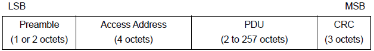

LE 1M PHY对应的Preamble为1字节（octet），LE 2M PHY对应2字节。其他几个部分对应的字节长度在两种物理层情况下相同。

对于LE 1M PHY，数据包长度为10 ~ 265字节，空中传输速率为1M sym/b，因此传输一个包所需要时间为80 ~ 2120us。

对于LE 2M PHY，数据包长度为11 ~ 266字节，空中传输速率为2M sym/b，因此传输一个包所需要时间为44 ~ 1064us。

传输过程中，先发送LSB部分，再发送MSB部分。所以Preamble最先现发送和到达，CRC殿后。

下面解释各个部分的详细含义。

#### 4.1.1 Preamble

数据包的前导码（Preamble）不包含有效用户数据，它仅用于频率同步、符号时序计算和自动增益控制。

前导码的内容是0/1交错序列，假如Access Address的首位是1，那么前导码的首位也是1，假如Access Address的首位是0，那么前导码首位也是0。这样就就可以保证前导码和Access Address的交接处是0/1交错，而不是两个相同的比特。

如下图所示，LE 1M PHY的情况和LE 2M PHY情况下，都保证前导码和Access Address的交界处是01交错。

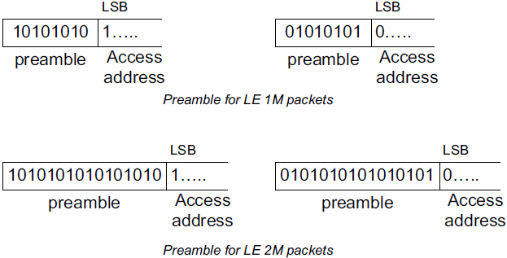

#### 4.1.2 Access Address

访问地址（Access Address）需要分情况讨论。

- 广播信道中的数据包，其访问地址为固定的0x8E89BED6。
- 数据信道中的数据包，在每次发起连接时会生成一个新的随机访问地址。
- 周期信道中的数据包，在每次发起周期广播时会生成一个新的随机访问地址。

访问地址长度为32-bit，需要满足诸多条件：

- 不能与现有连接或周期广播的访问地址相同
- 不能与广播信道的访问地址相同，也不能与它只差一位
- 不能有六个全0或全1
- 不能是四个相同的字节
- 0/1变化不能超过24次，在MSB方向的末尾6位中至少要有2次0/1变化。

满足这么多条件的可用的访问地址总量是有限的，实际中以系统的热熵作为随机数种子，生成一个随机的访问地址序列，如果新访问地址不能满足上述各个条件，则重新生成，直到获得满足条件的访问地址。

#### 4.1.3 PDU

PDU将在下文详细介绍。

#### 4.1.4 CRC

CRC校验只针对PDU部分，不包括访问地址部分，假如PDU需要加密，则计算加密后的PDU校验码。

CRC校验算法为24-bit的CRC多项式算法：x^24 + x^10 + x^9 + x^6 + x^4 + x^3 + x + 1，该算法从LSB开始计算。

### 4.2 编码型物理层包结构

编码型物理层的数据包结构相对更复杂，如下图所示。

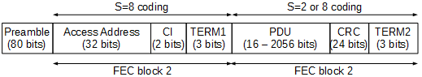

数据包长为161 ~ 2072 bits，符号传输速率为1M sym/s，前导码比特率为1Mb/s，FEC block 1比特率为125kb/s，FEC block 2比特率为125kb/s或500kb/s。

如果采用S=8编码，则总的传输时间为720 ~ 17040us；如果采用S=2编码，则总的传输时间为462 ~ 4542us。

前导码长度为80-bit，其内容为（00111100）重复10次组成的序列。前导码不进行编码处理。

访问地址与非编码型物理层的访问地址规则相同。

编码标识CI（Coding Indicator）决定了FEC Block 2部分所使用的编码方案。CI=00b表示FEC block 2使用S=8编码方案，CI=01b表示S=2编码方案。

终止符TERM1（Terminal）和TERM2是前向纠错FEC（Forward Error Correction）的算法一部分，长度为3个比特，它不包含用户数据。

PDU与非编码型物理层的PDU规则相同。

CRC与非编码型物理层的CRC规则相同。

前向纠错FEC（Forward Error Correct）block 1部分采用S=8编码，即一个比特由8个字符组成，比特率为125kb/s。

FEC block 2的编码方式根据CI选择S=8或S=2编码方式。

### 4.3 广播数据PDU

广播数据的PDU包括Header和Payload两部分，其结构图如下：

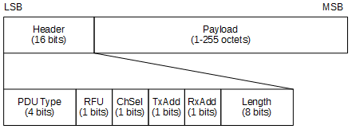

PDU Type比较复杂，不同的PDU类型，其数据颇有不同。下图展示了不同的PDU Type以及各自的使用物理层：

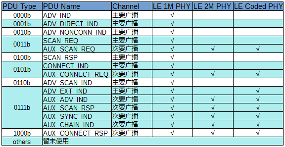

RFU（Reserved for Future  Use）字段可以忽略。

ChSel（Channel Selection）指定该Payload所在的信道号。这个字段可能并不使用。

TxAdd=1表示发送该PDU的设备地址为共有地址，0表示随机地址。

RxAdd=1表示接收该PUD的设备地址为共有地址，0表示随机地址。

Length字段表示Payload的实际长度，其有效范围为1 ~ 255。

#### 4.3.1 ADV_IND

这是最常用的PDU Type，该类型PDU使用在connectable和scannable undirected广播事件中，其结构如下：

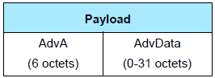

AdvA字段包含了该设备的地址，地址类型由PDU Header中的TxAdd决定。

#### 4.3.2 ADV_DIRECT_IND

该类型PDU使用在connectable directed广播事件中，其结构如下：

Payload中不包含广播数据内容。

AdvA地址类型由TxAdd决定，TargetA地址类型由RxAdd决定。

#### 4.3.3 ADV_NONCONN_IND

该类型PDU使用在non-connectable和non-scannable undirected广播事件中，其结构如下：

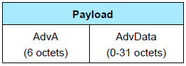

#### 4.3.4 ADV_SCAN_IND

该类型PDU使用在scannable undirected广播事件中，其结构如下：

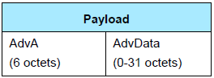

### 4.4 扫描数据PDU

#### 4.4.1 SCAN_REQ

该类型PDU使用在扫描请求事件中，它们的结构如下：

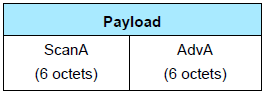

ScanA表示扫描设备地址，其中PDU Header中的TxAdd=0表示该地址为公有地址，TxAdd=1表示该地址为随机地址。

AdvA表示广播设备地址，其中PDU Header中的RxAdd=0表示该地址为公有地址，RxAdd=1表示该地址为随机地址。

#### 4.4.2 SCAN_RSP

该类型PDU用于扫描响应事件，其结构如下：

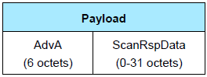

### 4.5 连接请求PDU

#### 4.5.1 CONNECT_IND

该类型PDU使用在connection request事件中，其结构如下：

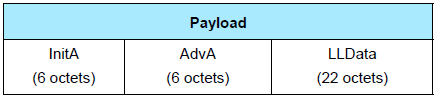

InitA表示主设备地址，其地址类型由TxAdd决定。

AdvA表示从设备地址，其地址类型由RxAdd决定。

LLData表示连接请求的内容，它包含了连接参数等信息：

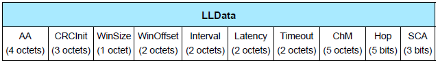

- AA表示访问地址（Access Address）。

- CRCInit表示校验运算的初值，由链路层随机生成。

- WinSize表示主从连接时的连接窗口。

- WinOffset表示主从连接时的连接窗口偏移量。

- Interval是连接参数之一，表示该次连接的连接间隔。

- Latency是连接参数之一，表示从设备的握手潜伏期。

- Timeout是连接参数之一，表示主设备判定从设备已断开的超时时间。

- ChM（Channel Map）表示信道占用图。该参数共40bit，第1位表示信道0，第2位表示信道1，以此类推，低37位表示信道36。信道37-39是纯广播信道，此处不做处理。前37个比特位，如果对应的信道曾经被使用过，则设置1，否则设置0。

- Hop表示跳频算法的增量，它的范围是[5, 16]。

- SCA（Sleep Clock Accuracy）表示BLE的睡眠时钟精度。SCA取值与睡眠时钟精度的关系如下表：

  | SCA  | 睡眠时钟精度          |
  | ---- | --------------- |
  | 0    | 250ppm - 500ppm |
  | 1    | 150ppm - 250ppm |
  | 2    | 100ppm - 150ppm |
  | 3    | 75ppm - 100ppm  |
  | 4    | 50ppm - 75ppm   |
  | 5    | 30ppm - 50ppm   |
  | 6    | 20ppm - 30ppm   |
  | 7    | 0 - 20ppm       |

### 4.6 扩展广播数据PDU

该类型的Payload全称为：Common Extended Advertising Payload，它在前面PDU基础上进行了扩充，包括以下子类型：

- ADV_EXT_IND
- AUX_ADV_IND
- AUX_SCAN_RSP
- AUX_SYNC_IND
- AUX_CHAIN_IND
- AUX_CONNECT_RSP

这些PDU具有相同的数据结构：

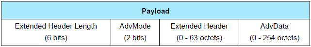

Extended Header Length表示Extended Header字段的长度，它的有效范围是0到63。

AdvMode表示广播事件发生时该设备所处的模式，它与各种模式的对应关系如下：

| AdvMode | 模式                            |
| ------- | ----------------------------- |
| 00b     | Non-connectable和Non-scannable |
| 01b     | Connectable和Non-scannable     |
| 10b     | Non-connectable和Scannable     |

#### 4.6.1 Extended Header

假如Extended Header长度不为0，那么它的结构如下：

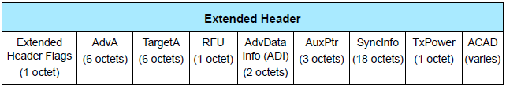

Extended Header Flags字段是其他后续字段的开关标志位。该字段有8个比特位，第1位为1表示Extended Header中包含AdvA字段，0则表示Extended Header中不包含AdvA字段。以此类推，第7位为1表示有TxPower字段，0表示没有TxPower字段。最后一位比特值不与ACAD关联，暂不使用。

AdvA表示广播设备地址。

TargetA表示扫描设备或发起连接设备的地址。

AdvData Info分两部分：Advertising Data ID(DID)和Advertising Set ID(SID)。假设一个广播包由多个子包组成，那么这些子包的SID相同，DID不同，如果DID也相同，则说明该包内容与前包内容一样。

AuxPtr（Auxiliary Pointer）表示辅助广播包的指针。它告诉链路层下一个辅助广播包的信道号和时间偏移。

SyncInfo意味着该广播包是一个周期广播包。‘

TxPower表示设备输出功率。

ACAD（Additional Controller Advertising Data）表示额外的广播数据。它与普通的广播包数据结构相同，但是仅能包含少量的几种数据：Service UUID、Manufacture Specific Data、Service Data和Channel Map Update Indication，其中最后个数据仅能放在ACAD中广播，普通的广播包中没有这一项。

#### 4.6.2 AdvData

AdvData中存放BLE广播数据，它最长不能超过1650字节。

如果一个PDU总长度填充到了255字节，仍然无法包含全部广播数据，链路层就会将广播数据分割成碎片（Fragment）放在不同的PDU中进行发送。

第一个广播包碎片类型可以是AUX_ADV_IND、AUX_SYNC_IND和AUX_SCAN_REQ之一。

后续广播包碎片类型则是AUX_CHAIN_IND。

所有的广播包碎片利用AuxPtr连接在一起，犹如C语言的链表。当最后一包碎片的AuxPtr等于0，则说明到达包尾。

### 4.7 数据通道PDU

数据通道PDU是指两个设备建立连接后，在0-36信道上发送的数据PDU。它的基本结构如下：

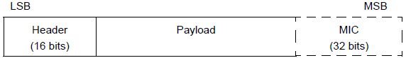

图中右侧虚线框MIC表示消息完整性检测（Message Integrity Check）字段，当Payload的长度大于0并且内容被加密，才需要用到它。

Header的结构如下：

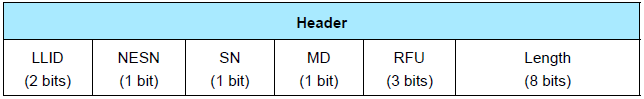

LLID（Link Layer ID）用以区分该PDU是一个数据PDU还是控制PDU。当LLID=11b，表示该PDU是一个控制PDU。当LLID=10b，表示该PDU是一个数据PDU的开头或结束碎片。当LLID=01b，表示该PDU是一个数据PDU的中间碎片。

NESN（Next Expected Sequence Number）表示下一个期望的PDU序号。

SN（Sequence Number）表示当前PDU序号。

MD（More Data）表示数据未完，后续还有相关PDU。

Length表示Payload+MIC的总长度。

#### 4.7.1 LL Data PDU

链路层数据PDU用以传输L2CAP层数据。

显然该情况下，LLID只能等于01b或10b。当LLID=10b，表示这是某个数据段的开头或结尾，Payload的长度不能是0。当LLID=01b，Payload的长度可以等于0，这是该PDU表示一个空PDU。

#### 4.7.2 LL Control PDU

链路层控制PDU用以控制链路层的连接。该PDU的结构如下：

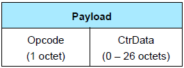

链路层的控制命令是可以枚举的，如下：

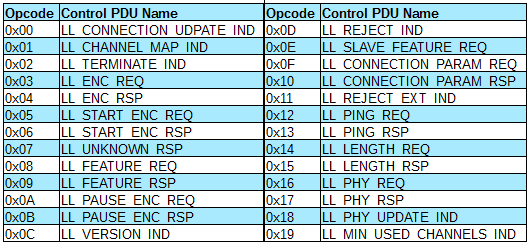

##5. 数据流处理流程

### 5.1 LE Uncoded PHY

对于非编码型物理层，数据流的处理流程如下：

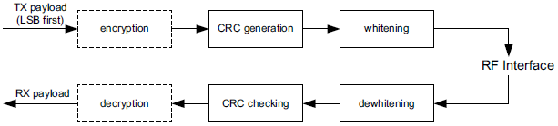

图中上面一行表示发送过程，数据流从左至右，BLE数据先进行加密，然后生成CRC校验信息，再进行白化（Whiten），从天线发射出去。

下面一行表示接收过程，数据流从右至左，执行发送过程的逆过程。

白化过程对数据序列执行多项式变化，使长串的0或长串的1被打散。因为接收机长时间接收0或1会产生信号频偏的质疑，链路层从协议角度避免这个质疑的发生。

反白化（Dewhiten）则将白化数据还原成原始数据。由于白化和反白化是完全公开可逆的，所以它们不是加密操作。

BLE数据接收时，再进入反白化之前，首先检查访问地址是否正确，检测失败的数据会被抛弃。

CRC校验失败的数据也会被抛弃。

### 5.2 LE Coded PHY

对于编码型物理层，数据流的处理流程如下：

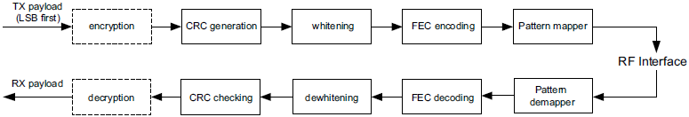

相对于非编码型物理层，这个流程中多了编解码过程。

编码（Coding）过程包含前向编码（FEC）和模式映射（Pattern Mapper）两个子过程。

前向编码将原始数据做卷积处理，处理后1个比特变成2个比特，模式映射对卷积结果进行展宽，展宽映射如下：

| 卷积结果 | 模式映射（S=2） | 模式映射（S=8） |
| ---- | --------- | --------- |
| 0    | 0         | 0011      |
| 1    | 1         | 1100      |

于是对于S=2情况，1个比特变成了2个比特，对于S=8情况，1个比特变为8个比特。

## 6. 空中接口协议

空中接口协议定义了链路层在各种状态下的具体过程和时序规范。

### 6.1 帧间隔

#### 6.1.1 帧内间隔（Inner Frame Space）

帧内间隔表示前一帧的末尾与下一帧的开头之间的时间。

这个间隔时间为固定150us，通常表示为T_IFS = 150us。

#### 6.1.2 最小辅助帧间隔（Min AUX Frame Space）

假如一个帧包含AuxPtr，最小辅助帧间隔表示该帧末尾与其辅助帧开头之间的时间。

这个间隔时间为固定300us，通常表示为T_MAFS = 300us。

### 6.2 时钟精度

链路层需要用到两个时钟精度参数，广播事件和连接事件使用活动时钟精度，其他事件则使用睡眠时钟精度。

活动时钟精度为±50ppm，睡眠时钟精度为±500ppm。

活动时钟驱动的行为事件，其时序误差应小于±2us，睡眠时钟驱动的行为事件，其时序误差应小于16us。

除此之外，BLE 5引入了一个距离延迟（Range Delay）的概念。

由于BLE 5极大的扩展了通信距离，假如两个设备相距1km，那么电磁波在空间传输，会产生一个时延，称为距离延迟。

电磁波速度为光速，考虑通信介质（空气），做了一个保守估计1/c = 4ns。

于是可以得到：距离延迟T(range) ≈ 2Distance * 4ns。

（蛋疼）

### 6.3 设备过滤机制

链路层基于设备地址BD_ADDR执行设备过滤机制，这样就可以筛选出关键设备。

广播状态、扫描状态和发起状态三种状态下的过滤机制相互独立，广播状态下有广播过滤策略，扫描状态下有扫描过滤策略，发起状态下有发起过滤了策略，BLE设备需要使用当前状态下合适的过滤机制。

#### 6.3.1 白名单列表

无论哪一种过滤策略，都需要使用白名单保存通过过滤策略的设备，而且三种过滤策略共享一个白名单。

白名单中保存设备的地址和地址类型。

#### 6.3.2 广播过滤策略

该策略决定了广播器如何处理扫描请求和连接请求。

主机可以设定为以下配置方案：

- 链路层仅处理白名单中的扫描和连接请求
- 链路层忽略白名单，处理全部扫描请求和连接请求。这是默认配置方案。
- 链路层处理全部扫描请求，仅处理白名单中的连接请求。
- 链路层处理全部连接请求，仅处理白名单中的扫描请求。

#### 6.3.2 扫描过滤策略

该策略决定了扫描器如何处理广播数据。

主机可以设定为以下配置方案：

- 链路层处理全部广播数据，如果定向连接的广播数据中不包含该扫描设备的地址，则忽略该广播数据。这是默认配置方案。
- 链路层仅处理白名单中的广播数据，如果定向连接的广播数据中不包含该扫描设备的地址，则忽略该广播数据。
- 链路层处理全部广播数据，如果定向连接的广播数据中不包含该扫描设备的地址，但字段TargetA包含扫描设备的地址，或一个可解析的随机地址，那么该广播数据被处理。
- 链路层仅处理白名单中的广播数据，如果定向连接的广播数据中不包含该扫描设备的地址，但字段TargetA包含扫描设备的地址，或一个可解析的随机地址，那么该广播数据被处理。

#### 6.3.2 发起过滤策略

该策略决定了发起连接的设备如何处理广播数据。

主机可以设定为以下配置方案：

- 链路层处理白名单中设备的广播数据。
- 链路层不管白名单，处理由主机指定的一个设备的广播数据。

### 6.4 待机状态

待机状态（Standby）是默认状态，链路层可以从待机状态进入其他各状态，也可以从其他各状态进入待机状态。

### 6.5 广播状态

广播状态下，链路层在广播事件中发送广播数据PDU。

一个广播事件中可以发送多个广播数据PDU。

广播事件分为以下几种：

- a connectable and scannable undirected event
- a connectable undirected event
- a connectable directed event
- a non-connectable and non-scannable undirected event
- a non-connectable and non-scannable directed event
- a scannable undirected event
- a scannable directed event

#### 6.5.1 广播事件

（1）传统广播事件

所谓传统广播事件就是BLE v4系列版本协议栈中应用的广播事件类型。

这类广播事件工作在37、38、39三个主要广播信道。如果收到连接请求，或发出扫描响应，则广播事件提前关闭。

两个广播事件之间的时间差称为广播间隔。广播间隔是一个整数乘以0.625ms，有效范围是20ms至10485.759375s。

两个相邻广播之间会加入一个0-10ms的随机时延，如下图：

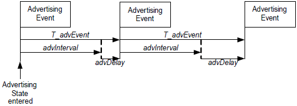

所以实际上两次广播事件之间的时间T_advEvent = advInterval + advDelay。

（2）扩展广播事件

工作在次要广播信道的广播行为，成为扩展广播事件。

扩展广播事件，包含了一个传统的广播PDU，以及一些列辅助广播PDU，如下图所示：

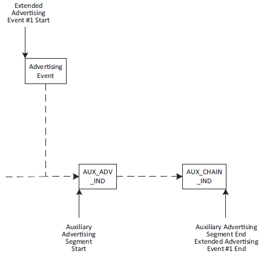

（3）周期广播事件

周期广播，顾名思义就是以一个恒定的连接间隔进行广播，广播一旦开始，就不能更改广播间隔。

周期广播使用AUX_SYNC_IND作为广播周期的标识，两个相邻的AUX_SYNC_IND PDU之间的事件间隔称为周期广播事件的广播间隔。如下所示：

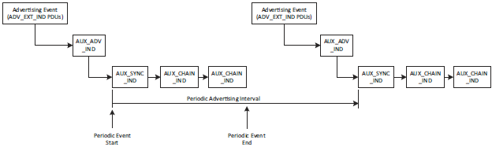

广播间隔是一个整数乘以1.25ms，有效范围是7.5ms至81.91875s。

#### 6.5.2 Connectable and Scannable Undirected Event Type

这是最常用的一类广播事件类型，它对应着ADV_IND广播PDU。

设备发送该类广播数据，对端设备可能发出扫描请求和连接请求，如果相应的扫描过滤策略或连接策略允许，则做相应的响应，否则关闭本次广播事件或跳到另一个主要广播信道继续当次广播事件。

如果设备发送该类广播数据，对端设备没有发出任何请求，则依次在37、38、39信道上发送ADV_IND类型PDU，如下图所示：

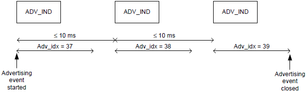

两个ADV_IND之间间隔应小于等于10ms，这三个ADV_IND的行为，表示一个广播事件。

如果对端设备发出扫描请求，则设备需要返回扫描响应，如下所示：

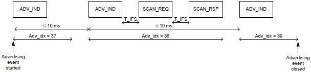

相邻PDU之前，需要延迟一个帧内间隔T_IFS=150us。

如果对端设备发出连接请求，则设备立即关闭当次广播事件，并准备建立连接，如下图：

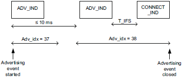

注意，传统的连接请求没有对应的连接响应，一旦主机设备发出连接请求，就假设从机设备收到该请求。而扩展的连接请求则有连接响应，主机发出扩展连接请求，需要从机返回连接响应。

#### 6.5.3 Connectable Directed Event Type

该类广播事件类型用于定向广播，它使用ADV_DIRECT_IND和ADV_EXT_IND两种类型PDU来传输广播数据，这两种PDU类型要分开讨论。

（1）使用ADV_DIRECT_IND

这种方式不能用在LE Coded PHY设备中。

该PDU中包括了对端设备的BD_ADDR，设备发出该类型PDU后，指定的对端设备收到可以发出连接请求，进而两边设备进入连接状态，准备建立连接。

该类型广播事件分为低占空比的广播和高占空比的广播两种类型。

低占空比的广播与Connectable and Scannable Undirected事件工作时序一致。

高占空比的广播的区别在于广播间隔大幅度缩短，相同信道上的两次PDU时间间隔应小于3.75ms，如下图所示：

根据上图，可以简单理解为广播间隔要小于3.75ms。

此外，高占空比的广播比较消耗信道资源，它最长持续时间为1.28s。即使在此期间没有收到连接请求，也仍然退出广播状态。

（2）使用ADV_EXT_IND

这种方式仅用在LE Coded PHY设备中。

设备先在主要广播信道发送ADV_EXT_IND广播数据，广播事件结束后，转入次要广播信道使用AUX_ADV_IND发送辅助广播数据。

在ADV_EXT_IND广播事件期间，不设置TargetA字段，因此无法收到对端设备的连接请求，进入AUX_ADV_IND扩展广播事件期间，设置TargetA字段，并监听对端设备的AUX_CONNECT_REQ辅助连接请求，假如收到则回复AUX_CONNECT_RSP辅助连接响应。

工作时序如下：

传统广播事件与扩展广播事件同时开始，主要广播信道工作完毕，传统广播事件即关闭，而在次要广播信道上，等收到辅助连接请求和辅助连接响应，则扩展广播事件关闭。

#### 6.5.4 Scannable Undirected Event Type

该类广播事件类型用于不连接仅响应扫描请求的广播，它使用ADV_SCAN_IND和ADV_EXT_IND两种类型PDU来传输广播数据，这两种PDU类型要分开讨论。

（1）使用ADV_SCAN_IND

虽然这类广播事件名称中带有SCAN字样的，但它是从机使用的广播数据类型。

设备发出ADV_SCAN_IND广播，监听SCAN_REQ请求PDU，如果过滤策略通过，则返回一个SCAN_RSP响应数据，然后跳到下一个主要广播信道中继续广播。

这一类广播类型，会忽略CONNECT_REQ，所以永远不会建立连接。其他方面与ADV_IND一致，如下图：

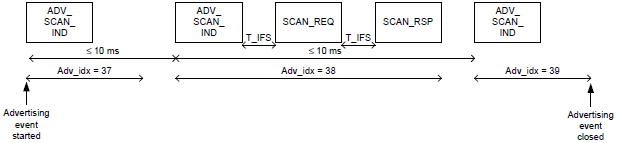

（2）使用ADV_EXT_IND

设备先在主要广播信道发送ADV_EXT_IND广播数据，广播事件结束后，转入次要广播信道使用AUX_ADV_IND发送辅助广播数据。这与Connectable Directed事件类型一致。

在ADV_EXT_IND广播期间，PDU中不附带AdvA字段，即广播包中没有自己设备地址信息，不能完成扫描响应。进入次要广播信道后，开始监听AUX_SCAN_REQ辅助扫描请求数据，并按照广播过滤策略返回AUX_SCAN_RSP数据。如下图：

#### 6.5.5 Non-Connectable and Non-Scannable Undirected Event Type

该类广播事件类型用于既不响应连接请求也不响应扫描请求的广播，它使用ADV_NONCONN_IND和ADV_EXT_IND两种类型PDU来传输广播数据。

ADV_NONCONN_IND不能用于LE Coded PHY类型设备。

除了不对扫描请求做出响应，该类型与Scannable Undirected事件类型基本一致。

#### 6.5.6 Connectable Undirected Event Type

该类型与Connectable  Directed 事件类型相似，监听连接请求并忽略扫描请求。但是该类型不限制对端设备的地址，任何设备都可以对其发出连接请求。该类型只适用于扩展广播事件，其对应的PDU类型为ADV_EXT_IND。

#### 6.5.7 Scannable Directed Event Type

该类型与Scannable Undirected事件类型相似，监听扫描请求并忽略连接请求。但是该类型限制对端设备地址，仅地址匹配的对端设备对其发出扫描请求才会得到响应。该类型只适用于扩展广播事件，其对应的PDU类型为ADV_EXT_IND。

#### 6.5.8 Non-Connectable and Non-Scannable Directed Event Type

该类型与Non-Connectable and Non-Scannable Undirect事件类型相似，忽略所有扫描请求和连接请求。该类型只适用于扩展广播事件，其对应的PDU类型为ADV_EXT_IND。

该类型的应用场景暂不明确。

#### 6.5.9 周期广播

该类型主要用于周期性发送广播数据的场合，在周期广播期间，不能更改广播间隔，但是能更新广播数据。该类型使用AUX_SYNC_IND类型PDU，

### 6.6 扫描状态

链路层在扫描状态下在主要广播信道监听广播数据。

如果被动扫描，则不发任何数据，如果是主动扫描，则发出扫描请求并监听扫描响应。

扫描行为的持续过程称为扫描窗口scanWindow，两次扫描行为之间的时间间隔成为扫描间隔scanInterval，显然扫描窗口不能大于扫描间隔，如果扫描窗口等于扫描间隔，链路层将持续扫描。

扫描间隔的最大值是40.96s。

假如广播设备扩展广播，链路层还需监听次要广播信道中的辅助广播包。

链路层监听到广播数据，或接收到扫描响应数据，则向主机发出广播报告（Advertising Report）。

### 6.7 发起状态

发起状态与扫描状态类似，也具有扫描窗口和扫描间隔两个参数。

该状态下链路层监听主要广播信道上的广播数据，并可以发出连接请求。如果广播设备使用扩展广播，则链路层还需监听次要广播信道上的辅助广播数据。

在主要广播信道上发出连接请求，不能使用在LE Coded PHY设备上。一旦发出连接请求，设备即退出发起状态并进入连接状态。

在次要广播信道上发出连接请求，仅能使用在LE Coded PHY设备上。发出连接请求后，设备会监听连接响应，等接收到连接响应，才退出发起态并进入连接态。

### 6.8 连接状态

一旦进入连接状态，就视为建立了连接。

链路层属于Master Role的设备称为主机（master），属于Slave Role的设备称为从机（slave）。

建立连接后，主机会发出一个数据并等待从机的响应，如果在6个连接间隔事件内都未等到从机的数据包，则视为连接断开。

#### 6.8.1 连接事件

链路层仅在连接事件中发送PDU数据。在一个连接事件内，可以发出多个PDU，相邻PDU之间至少保留T_IFS时间。

连接事件的时序受两个参数的影响：连接间隔connInterval和从机潜伏次数connSlaveLatency。

两个连接事件之间的事件间隔称为连接间隔。连接间隔是一个整数乘以1.25ms，有效范围是7.5ms至4s。

从机无需监听每一次主机的连接事件，忽略的事件总数称为connSlaveLatency。主机设置一个监听超时参数supervisionTimeout，当主机等待超时仍未获得从机的响应，则认为连接断开，并向主机报告。所以潜伏次数应小于((connSupervisionTimeout / (connInterval×2)) - 1)。

从机维护一个16-bit的变量connEventCount，以记录连接事件的总数。

监听超时是一个整数乘以10ms，有效范围为100ms至32s。假如设定了潜伏次数，监听超时应该大于：(1 + connSlaveLatency) × connInterval × 2。

#### 6.8.2 连接过程 - 主机端

主机在发出CONNECT_REQ之后，即进入连接状态，然后等待一会时间，发送第一个数据包。

等待的时间主要是为了留下空余让从机有充分时间唤醒和准备。

等待的时间包括三个参数：transmitWindowDelay，transmitWindowOffset和transmitWindowSize。其中第一个参数对于不同的物理层实现是一个固定值，后两项则可以通过主机进行设置。

主机连接过程的时序图如下：

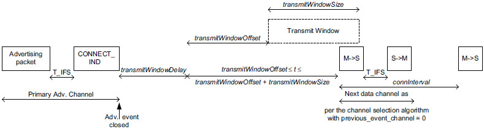

主机的一个数据包总是在发送窗口（Transmit Window）中发送，发送窗口的时序位置由以上三个参数共同确定。

辅助广播包引起的连接过程，与上图基本一致。

#### 6.8.3 连接过程 - 从机端

在建立连接时，从机端需要监听主机端发出的第一包数据。假如从机错过了传输窗口，则在下一个连接间隔中监听主机第一包数据。如下图所示：

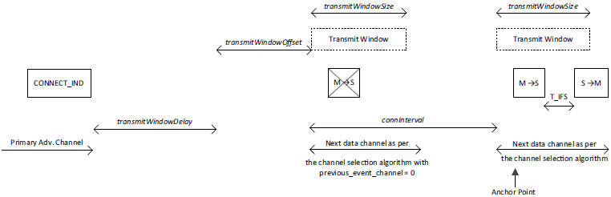

辅助广播包引起的连接过程，与上图基本一致。

#### 6.8.4 关闭连接事件

当连接事件中仅有一个PDU需要发送，则发送完毕后即可关闭连接事件。注意，关闭连接事件并非断开连接，仅表示当次数据传输事件完毕。

如果连接事件中有多个PDU需要发送，那么将在PDU中设置MD（More Data），在一个PDU发送完毕后持续发送，知道全部PDU发送完毕，再关闭连接事件。

每次主机发送一个PDU，从机都需要返回一个响应。假如从机没有返回响应，则主机中断发送，关闭连接事件。如果PDU没有发送完毕，从机没有收到主机发送的数据包，则从机端关闭连接事件。如果PDU的CRC校验失败，则关闭连接事件。

#### 6.8.5 确认和流程控制

（4.5.9， 实在恶心的不行了）

## x. 链路控制

## x. 隐私

