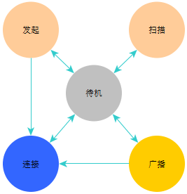
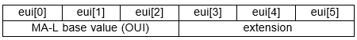
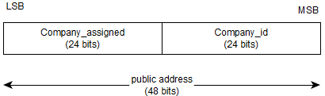
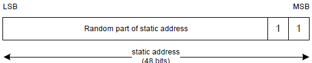
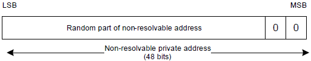
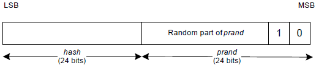
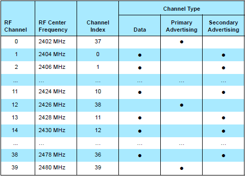

# 深入BLE协议栈 —— 链路层

## 1. 状态机

链路层设计了五种工作状，涵盖了链路层的全部操作状态：

- 待机（Standby）状态
- 广播（Advertising）状态
- 扫描（Scanning）状态
- 发起（Initiating）状态
- 连接（Connection）状态

待机状态下，系统不做任何广播和扫描动作，可以维持低功耗。

广播状态下，系统对外发出广播数据和扫描响应（Scan Responding）数据。扫描响应数据也是一种广播数据，但它是在扫描端设备发出请求，本机监听到请求以后才向外发出的一种广播数据。这个过程中除了发送，还有监听的过程。

扫描状态下，系统监听外部的广播数据。扫描状态并不能直接进入连接状态，它不具备发起连接的能力。

发起状态与扫描状态类似，也是监听外部的广播数据，但是它可以发起连接请求，主动建立连接，然后进入状态。

连接状态下，BLE设备之间保持着连接关系，开展通信行为。

这五种状态共同组成一个状态机，它们相互转换关系如下图：

观察上图，扫描态无法直接进入连接态，初次连接链路层状态要么是发起态，要么是广播态。从待机状态进入连接状态通常发生在连接已经建立好的情况。

如果设备从发起态进入连接态，称为主设备（Master Role），如果从广播态进入连接态，称为从设备（Slave Role）。

主设备发起连接请求，并且会设定连接过程的一些列时序参数。

从设备接受主设备设定的参数，并遵守参数进行通信。

在一个时刻，状态机只能处于一种状态，而链路层可以同时拥有多个状态机。这就意味着，BLE设备在一个状态机中保持连接状态的同时，另一个状态机保持广播状态，或者多个链路状态机同时处于连接状态，这是BLE设备实现多个连接的基础。

同时多个连接问题，容易引起误会，这里仔细将情况描述清楚：

1. 如果设备A已经跟设备B保持连接，那么设备A可以执行广播或扫描操作。
2. 如果设备A已经跟设备B保持连接，并且设备A是主设备，那么设备A能够跟其他从设备再次建立连接。
3. 如果设备A已经跟设备B保持连接，并且设备A是主设备，那么设备A能够跟其他主设备再次建立连接。
4. 如果设备A已经跟设备B保持连接，那么不能实现设备A扫描，设备B广播并再次建立连接。设备A与B之间只能维持一个连接状态机。

## 2. 设备地址

设备地址常记作：BD_ADDR (Bluetooth Device Address)，是一个6字节整形数。

设备地址可以分为以下几类：

- <u>公有地址</u>
- 随机地址
  - <u>静态地址</u>
  - 私有地址
    - 不可解析的私有地址
    - 可解析的私有地址

BLE设备具有一个或多个类型的地址，比如同时具有公有地址和可解析的私有地址。

注意带下划线的公有地址和静态地址，这两类地址可作为BLE设备的识别码，任何BLE设备至少要具有二者之一，它们也是通信数据包中的一部分。

协议栈使用1比特记录当前设备地址是公有地址还是随机地址。

### 2.1 公有地址

公有地址是一种符合IEEE标准的48bit长度的唯一识别码，类似于XX-XX-XX-XX-XX-XX。创建合法有效的地址，需要在IEEE网站上注册购买。IEEE对这类48bit的地址取名为MA-L（MAC Address Block Large）地址。

IEEE注册页面为：http://standards.ieee.org/develop/regauth/index.html

MA-L分为两部分，前三字节为OUI，后三字节为扩展，如下图所示（[链接](https://standards.ieee.org/develop/regauth/tut/eui.pdf)）：

前三字节的OUI（Organizationally Unique Identifier）表示组织识别码，后三字节通常是基于OUI再进行自主分配，所以申请MA-L地址段，主要就是获取OUI。

目前主流的半导体厂商都已注册自己的OUI，比如Cypress Semiconductor Ltd的OUI为00 A0 50，理论上其他公司的产品不允许使用这三个字作为BD_ADDR的起始三字节。

在上述注册页面，能找这些已分配的MA-L下载地址：https://standards.ieee.org/develop/regauth/oui/oui.csv 也可以从网站进行查询指定的OUI：https://www.wireshark.org/tools/oui-lookup.html

公有地址分为两部分：company_id和company_assigned，如下图所示

其中company_id就相当于OUI，company_assigned则是公司自主分配，在确定了OUI以后，三字节的company_assigned总共可以分配超过一千万个设备。

值得注意的是，BLE 5的协议文档中已经删除了company_id和company_assigned这种结构，SIG这么做可能是希望协议层面摆脱这种设定。

公有地址是公开的和固定的，一个设备的公有地址为112233-445566，那么它对外永远都显示这个地址，并且所有的BLE主设备都能够看到这个地址。

### 2.2 静态地址

静态地址可以选择在每次给设备上电时更新地址，上电之后则需要维持不变。

静态地址末尾2位必须是11，其他46位不能是全0或全1，它的结构如下：

新的静态地址的生成通常是由协议栈自己完成，无需外部干预。

由于静态地址是随机生成，就避免了公有地址的唯一性问题，无向需IEEE申请注册。不过绑定过程对端设备会记录当前设备的地址信息，当静态地址更新，需要同时更新对端设备所记录的绑定信息。

### 2.3 不可解析的私有地址

不可解析的私有地址会在每次重连时改变地址，并且新的随机地址无法被解析。直观上看，这个方案阻止其他设备对其进行绑定，它的作用暂不明朗。

不可解析的私有地址，末尾2位必须是00，其他46位不能是全0或全1，并且该地址不能与公有地址相同，它的结构如下：

### 2.4 可解析的私有地址

可解析的私有地址会定时改变地址，新的地址可以通过绑定信息IRK解析出来设备的静态地址或公有地址，因此这种地址方案通常跟绑定操作搭配使用。

iOS设备与Android 5以上的设备，默认采用这种地址方案，地址更新时间间隔大约为15分钟。即使用这些手机与设备建立连接，15分钟后会发现手机的设备地址发生了改变。

可解析的私有地址，末尾2位必须是10，其他46位不能是全0或全1，它的结构如下：

生成私有地址过程中，利用绑定过程中生成的密钥IRK以及一个随机数，生成一个Hash值。解析时根据新的随机地址和IRK，再生成一个Hash，如果与前面的Hash匹配，则解析通过。

采用可解析的私有地址，设备需要同时使用公有地址或静态地址之一。

## 3. 物理信道

在物理层的介绍中，提到了BLE将2.4GHz频段分成了40个物理信道，相邻信道频率间隔为2MHz。

这40个物理信道分成三类：

- 广播信道
- 周期信道
- 数据信道

其中广播信道又分为两种情况：主要广播信道和次要广播信道。

主要广播信道使用3个信道：37信道（2.402GHz），38信道（2.426GHz）和39信道（2.480）GHz，这3个信道用于发送广播消息，扫描广播消息和发起连接。

次要广播信道使用剩余37个信道：0至36信道。这些信道主要发送和扫描扩展广播包中的广播消息。

周期信道和数据信道也使用0至36信道。

数据信道主要用于已经建立连接的两个设备之间的数据交换。

周期信道为BLE 5新加入的信道类型，它不直接参与数据通信，由于与数据通道使用相同的信道，它可以看到数据信道的内容，这是BLE测试分析仪器使用的信道类型。

40个物理信道的频率和作用如下图所示：

其中RF通道的编号在BLE协议中被重新编号，称为信道变化（Channel Index）。

两个BLE设备通信时，必须使用相同的信道。假如在一个狭小空间，有大量的BLE设备，可能导致同一时刻有多个设备都在使用相同的信道进行通信，为了区分不同设备，需要借用链路层数据帧中的访问地址（Access Address）的内容，访问地址是数据帧的帧头信息，摆在链路层数据帧的开头位置。

当两个BLE设备之间同步了信道、时序、访问地址等信息，就称二者已建立“连接”或已完成“同步”。“连接”状态是针对工作在数据信道的设备而言，“同步”状态是针对工作在周期信道的设备而言。

## 4. 空中接口包

## 4. 空中接口协议

## 5. 链路控制

## 6. 隐私

